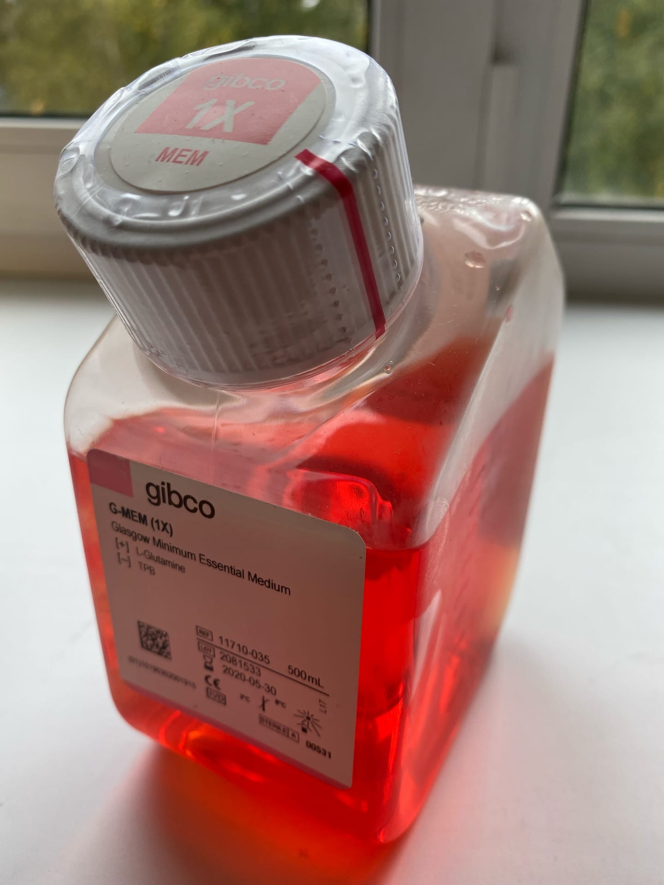

### Реактивы для работы с мышиными ЭСК

1.  Список реактивов, обязательных для работы с эмбриональными стволовыми клетками мышей:

    1.  *Минимальная среда (G-MEM).* Мы используем Glasgow Minimal Essential Medium, G-MEM (**Gibco 11710-035**)

        {width="300"}

2.  *Фетальная телячья сыворотка, пригодная для ЭСК (ES-FBS)*. По нашему опыту лучшими являются:

    -   HyClone FBS DEFINED Murine ESC Screened (**HyClone SH30070.03**)

        {width="300"}

    -   Capricorn FBS ES Pretested (**Capricorn FBS-ES-12A**)

        {width="300"}

```{r echo=FALSE}
blogdown::shortcode("notice","note" ,.content = "Сыворотки хранятся на -20 градусах. Перед использованием белки системы комплемента в сыворотке должны быть инактивированы. Это достигается нагреванием FBS до 56 градусов в водяной бане в течение 30 минут. После инактивации сыворотку аликвотируют по 40-45 мл в фальконы на 50. Далее фальконы помечают инициалами \"iES-FBS\" и замораживают в вертикальном положении. Перед аликвотированием стоит дождаться, когда на дно бутылки полностью выпадет осадок.")
```

1.  
